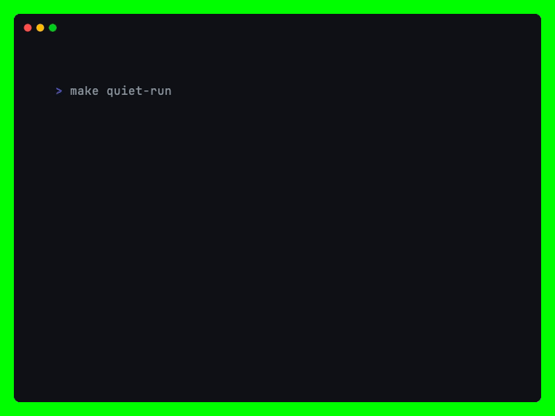

# 🍦 Ice Cream Shop CLI

A Command Line Interface (CLI) application built in MATLAB/Octave for managing ice cream orders and basic business analytics.

## 🚀 Features

- **Interactive Menu:** Selection of flavors and pricing.
- **Order Management:** Ability to add multiple items to a single session.
- **Data Filtering:** Backend logic to identify and filter orders based on size.
- **Mathematical Analysis:** Calculated totals using vectorized matrix operations.
- **Data Visualization:** Automatic generation of a bar chart showing order distribution.

## 📺 Demo

<picture>
  <source media="(prefers-color-scheme: dark)" srcset="demo-dark.gif">
  <source media="(prefers-color-scheme: light)" srcset="demo-light.gif">
  
</picture>

## 🛠️ Requirements & Installation

This project is compatible with **GNU Octave** and **MATLAB**.

### Prerequisites

- GNU Octave (Open Source)
- Or a standard MATLAB installation.

### Running the Program

Using the provided Makefile:

```bash
make run
```

Or run directly from the terminal:

```bash
ice_cream_shop
```

## 💻 Technical Implementation

- **Loop Logic:** Implemented using boolean flag control for safe execution.
- **Matrix Operations:** Uses array augmentation to store session data and element-wise multiplication for pricing calculations.
- **Modular Structure:** Separated into a main control function with specialized sub-functions for data processing and graphing.

---

_Created for terminal-based data processing demonstration._
